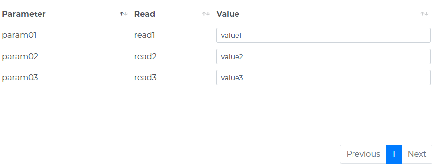

<h1 align="center" style="margin-top: 0px;">Table CWC made for WinCC Unified</h1>

<p align="center" style="margin-bottom: 0px !important;">
  
</p>


### **1. CONTENT**

HTML table 

### **2. INTERFACE**

  - **columns** : Array of element for the columns title 

  ```js 
      // Example
      columns: ["Parameter", "Read", "Value"]
  ```

  - **columnsEdit** : Array of bool Flag to enable or diable (False / True) the text input area on a colum

  ```js 
      // Example
      columnsEdit: [false, false, true]
  ```
  
  - **columnsShow** : Array of bool Flag to hide or dhow (False / True) a colum

  ```js
      // Example
      columnsShow: [true, true, true]
  ```

  - **pageLength** : Number of rows to be shown in one tab (i.e. 18)

  - **rows** : Array of element to fill the table rows

  ```js
      // Example
      rows: [["param01", "read1", "value1"], ["param02", "read2", "value2"], ["param03", "read3", "value3"]],
  ```
  
  - **searching** : Flag to disable or anable (False / True) the search filed on top of the tabale (i.e. false)

  - **select** : Flag to diable or enable (False / True) the selcion of the rows (i.e. true)

### **3. EVENTS**

  - **ev_selectRow** : This event is triggerd every time an user select or deselect a row, as a  result if a row is selected in the "rowId" object is returned the content of the row with this structure:
    - rowId = Row first column value
    - rowVals = Array of values of all columns in the row
  - The column value is returned also if that colum is not visible

  ```json
      // Example
      {"rowId":"param01","rowVals":["param01","read1","value1"]}
  ```

  - **ev_updateRows** : This event is triggerd every time an user update a row value by the text input area, as a result in the "rows" object is returned the updated content of the all the rows

  ```json
      // Example
      [["param01", "read1", "value1"], ["param02", "read2", "value2"], ["param03", "read3", "value3"]]
  ```

    - **ev_updateRow** : This event is triggerd every time an user update a row value by the text input area, as a result in the "rows" object is returned the updated content of the all the updated row

  ```json
      // Example
      ["param01", "read1", "value1"]
  ```

### **4. USAGE**

  - OFFLINE MODE
    - You can test the behavior of the table with custom data by setting "production" to false
    - Now you can change all the data from "WebCC.Properties"

    ```js
    var production = false;
    //...
    WebCC.Properties = {
      select: true,
      searching: false,
      columns: ["Parameter", "Read", "Value"],
      columnsEdit: [false, false, true],
      columnsShow: [true, true, true],
      rows: [["param01", "read1", "value1"],
             ["param02", "read2", "value2"],
             ["param03", "read3", "value3"]
            ],
      pageLength: 18
    };
    ```

  - ONLINE MODE (WinCC Unfied)
    -  Set "production" to true
    ```js
    var production = true;
    ```
    - To import the custom web control the hierarchy of folders and files must be compressed in ZIP format.
    - The name of the ZIP must be the GUID used the "manifest.json" file surrounded by curly brackets

    ```json
      type": "guid://2823CFDE-FEE3-4B14-A792-96E2201EEAB8",
    ```
    - {2823CFDE-FEE3-4B14-A792-96E2201EEAB8}.zip
    - If you want this custom web control available for all your project, copy this file in the folder : 
      - C:\Program Files\Siemens\Automation\Portal V17\Data\Hmi\CustomControls
      - replace "Porla V17" with your Tia version.
    - If you want to use this custom web control only in one project copy this file in the folder :

      - \path_to_tia_project\UserFiles


    - Refresh "My controls" to update the files in TIA Portal
    - Now you can place the custom web control in the Screen.

      <p align="center" style="margin-bottom: 0px !important;">
        
      </p> 

